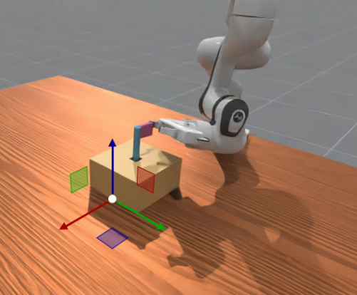

## Custom Env: Place the Flag 🚩 at the Specified Location (PlaceFlag-v2)

A reinforcement learning environment where a robot must place a flag into a designated hole while maintaining vertical orientation.

### Task Description
- A digital agent operates a GUI interface by clicking or moving to specific locations to mark certain targets (Flags), changing their status (e.g., setting them as "Completed," "Special Reminder," etc.).

- Physical Agent inserts the flag on the desktop into the designated hole in my task

- The initial x, y coordinates of the flag are randomized.

### PlaceFlag-v2 Enhancements
The v2 version builds upon the original PlaceFlag-v1 with the following improvements:

1. Enhanced Reward Design: Enhanced reward function with improved gradient signals for more efficient learning

2. Orientation Focus: Special emphasis on the flag's vertical orientation using angle-based rewards

3. Multi-stage Learning: Progressive reward structure that guides the agent through different stages of the task

### Reward Structure

```
reward = terminal_success + positioning + orientation + staged_bonuses
```

#### Components

1. **Terminal Success (5.0)**: Awarded upon task completion

2. **Positioning Rewards**:
     - Horizontal alignment (xy-plane): `exp(-3.0 * xy_distance) * 1.0`
     - Height alignment (z-axis): `exp(-5.0 * z_distance) * 0.8`
3. **Orientation Reward:**

   - Flag verticality: `exp(-5.0 * (angle/90.0)) * 0.8`
   - Treats flag as a line segment to simplify orientation representation
4. **Staged Completion Bonuses:**

   - Position + height correct: +0.2
   - Position correct + vertical orientation: +0.8
   - All conditions nearly met but not successful: +1.0

### Final Success Example

  

  
